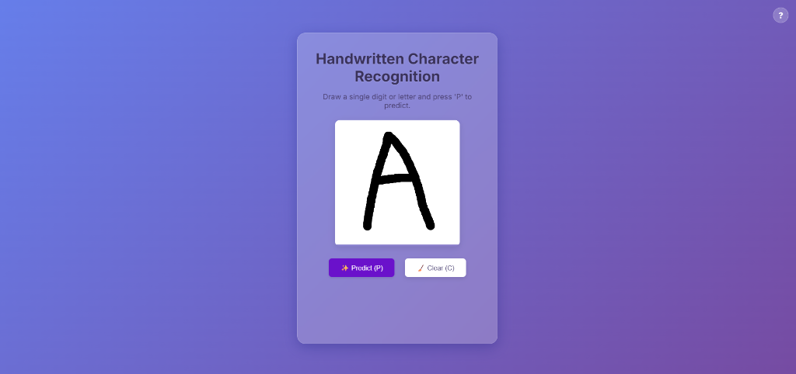
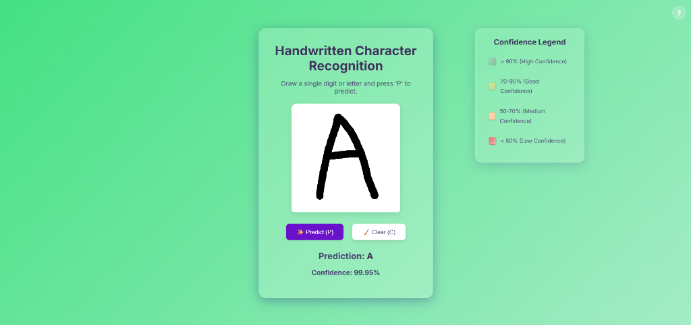
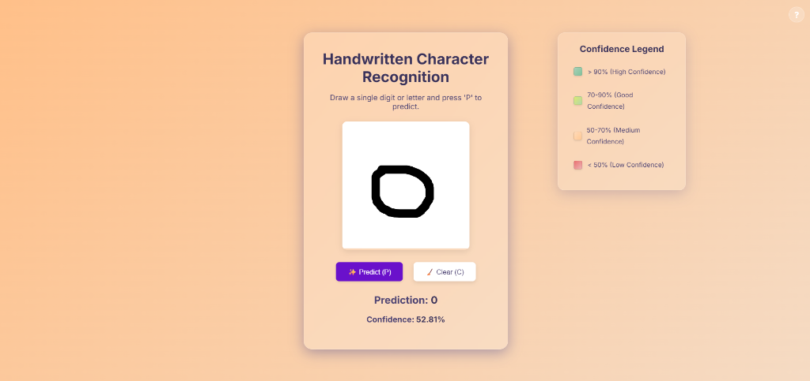

<p align="center">
  
</p>

<h1 align="center">Handwritten Character Recognition</h1>
<h3 align="center"><em>Real-time prediction of handwritten letters and digits.</em></h3>

<p align="center">
  An end-to-end Machine Learning web application that classifies handwritten digits and English letters (62 distinct classes) in real time using a Convolutional Neural Network (CNN) and an interactive HTML5 drawing canvas.
</p>

<p align="center">
  
  
  
  
  
</p>

---

## 📖 About

**Handwritten Character Recognition** is a web-based tool that translates your handwriting into digital text. You draw a character on the canvas, hit predict, and the model tells you what it sees—along with a confidence score. 

The background color of the page dynamically changes based on the prediction's confidence (green for high, orange for medium, red for low), providing immediate visual feedback. 

---

## 📸 Screenshots

<p align="center">
  
  &nbsp;&nbsp;&nbsp;
  
  &nbsp;&nbsp;&nbsp;
  
</p>

### Drawing Canvas (left)
The main interface features a responsive HTML5 drawing canvas with a custom pencil cursor. Users can draw any digit or letter (uppercase or lowercase). The UI features a modern glassmorphism design.

### High Confidence Prediction (center)
Once the 'Predict' button is pressed, the drawing is sent to the backend, preprocessed, and fed to the CNN. Here, the letter "A" is predicted with a very high confidence of 99.95%, triggering a green background and displaying the "Confidence Legend".

### Ambiguous Characters / Low Confidence (right)
Some symbols inherently look alike and are ambiguous without context. For example, the digit `0` can easily be mistaken for the uppercase `O` or lowercase `o`, and vice versa. In these cases, the model's confidence naturally drops (e.g., 52.81%), and the UI reflects this uncertainty with an orange or red background.

---

## 🏗️ Architecture & Preprocessing

```text
┌─────────────────────────┐       ┌─────────────────────────┐
│     HTML5 Frontend      │──────▶│      Flask Backend      │
│                         │       │                         │
│  • Canvas Drawing       │       │  • Image Preprocessing  │
│  • Base64 Image Export  │       │  • CNN Inference        │
│  • Dynamic UI Colors    │◀──────│  • Confidence Scoring   │
└─────────────────────────┘       └─────────────────────────┘
```

Getting a web canvas drawing to match the model's training data formatting takes a few crucial steps. Getting this wrong is the primary reason models fail in production:

1. **Background composite:** The canvas sends a PNG with transparency. We composite it onto a white background.
2. **Grayscale:** Convert the image to grayscale.
3. **Transpose:** EMNIST images are natively stored transposed (columns and rows swapped). Real-world drawings must be transposed to match this orientation.
4. **Invert:** Humans draw black strokes on white canvases, but EMNIST uses white strokes on a black background.
5. **Resize & Normalize:** Resize to 28×28 pixels, normalize pixel values to `[0, 1]`, and reshape to `(1, 28, 28, 1)`.

---

## 🧠 Model Structure

The model is built using TensorFlow/Keras and trained on the **EMNIST ByClass** dataset (~814,255 images, 62 classes).

We chose a **Sequential Convolutional Neural Network (CNN)** architecture because CNNs are exceptionally good at capturing spatial hierarchies and local patterns (like edges, curves, and loops) in image data, which is perfect for character recognition.

- **Data Augmentation:** Random rotation, zoom, and translation layers are built directly into the model graph to improve generalization.
- **Convolutional Blocks:** 3 blocks of `Conv2D` layers (32 → 64 → 128 filters) using ReLU activation. Each block includes `BatchNormalization` for stability and `MaxPooling2D` for spatial downsampling.
- **Dense Classifier:** A fully connected `Dense` layer with 256 units, followed by 50% `Dropout` to prevent overfitting, and a final `Dense` layer with a Softmax output over the 62 classes.

---

## 🛠️ Tech Stack

| Layer | Technology | Purpose |
|---|---|---|
| **Frontend** | [HTML5 Canvas](https://developer.mozilla.org/en-US/docs/Web/API/Canvas_API) & JS | Interactive drawing interface |
| **Backend** | [Flask](https://flask.palletsprojects.com/) | REST API and web server |
| **Machine Learning** | [TensorFlow / Keras](https://www.tensorflow.org/) | CNN architecture, training, and inference |
| **Data Processing** | [Pillow (PIL)](https://python-pillow.org/) & [NumPy](https://numpy.org/) | Image manipulation and array formatting |
| **Dataset** | [EMNIST ByClass](https://www.nist.gov/itl/products-and-services/emnist-dataset) | 62-class extended MNIST dataset |

---

## 📁 Repository Structure

```text
character-recognition/
├── src/
│   ├── model.py                    # CNN architecture definition
│   ├── train.py                    # Training script & dataset pipeline
│   └── predict.py                  # CLI prediction script
├── templates/
│   └── index.html                  # Main web application template
├── static/
│   ├── css/style.css               # Glassmorphism styling and responsive layout
│   └── js/main.js                  # Canvas logic, prediction requests, and shortcuts
├── notebooks/
│   └── best-model-building.ipynb   # Jupyter notebook with experimentation and model building
├── screenshots/                    # Application preview images
├── app.py                          # Flask backend server
├── emnist_cnn_62_class_v1.h5       # Pre-trained CNN model weights
├── Dockerfile                      # Containerization setup
└── requirements.txt                # Python dependencies
```

---

## 🚀 Getting Started

### Prerequisites

- [Python 3.8+](https://www.python.org/)
- `pip`

### Installation

```bash
# Clone the repository
git clone https://github.com/nikolasfragkos/character-recognition.git
cd character-recognition

# Install dependencies
pip install -r requirements.txt
pip install flask pillow

# Run the app
python app.py
```

Open `http://127.0.0.1:5000` in your browser.

### Command Line Interface

You can also predict from a saved image without running the web server:

```bash
python src/predict.py --image path/to/your/image.png
```

---

<p align="center">
  <em>Handwritten Character Recognition — From strokes to text.</em> ✍️
</p>
